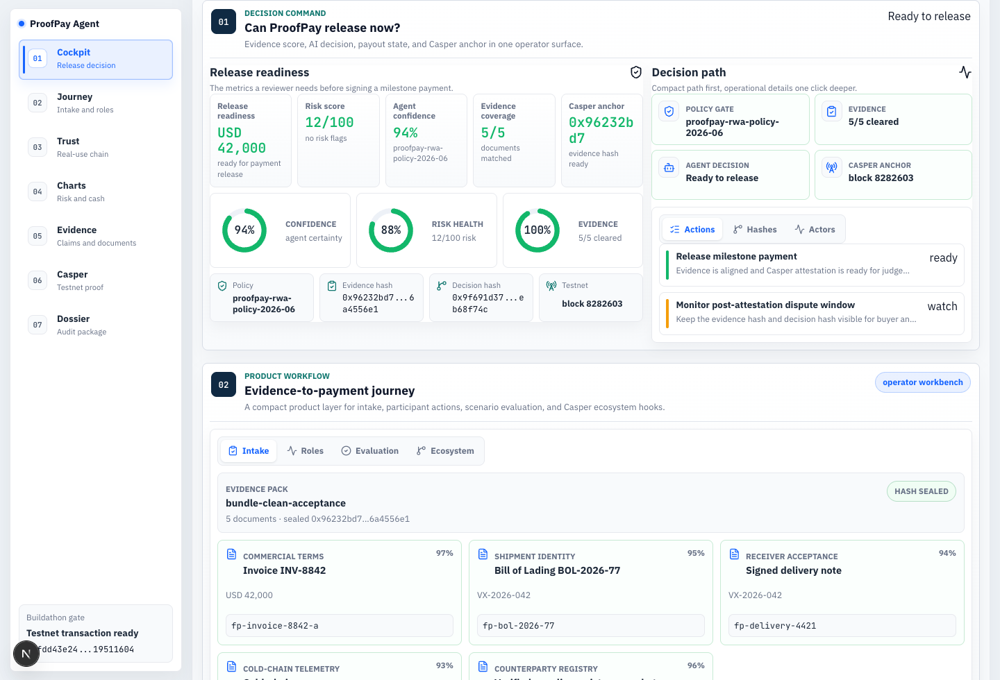
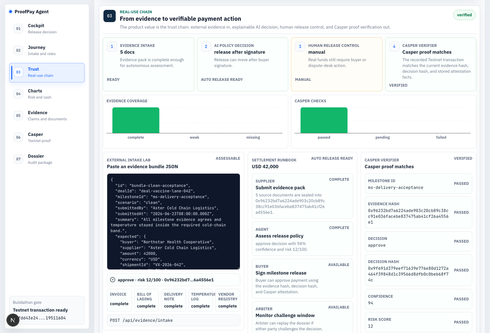
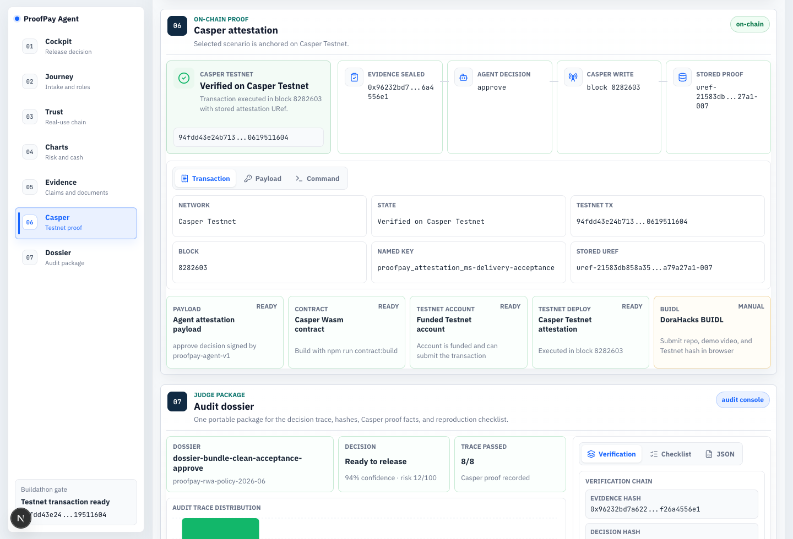
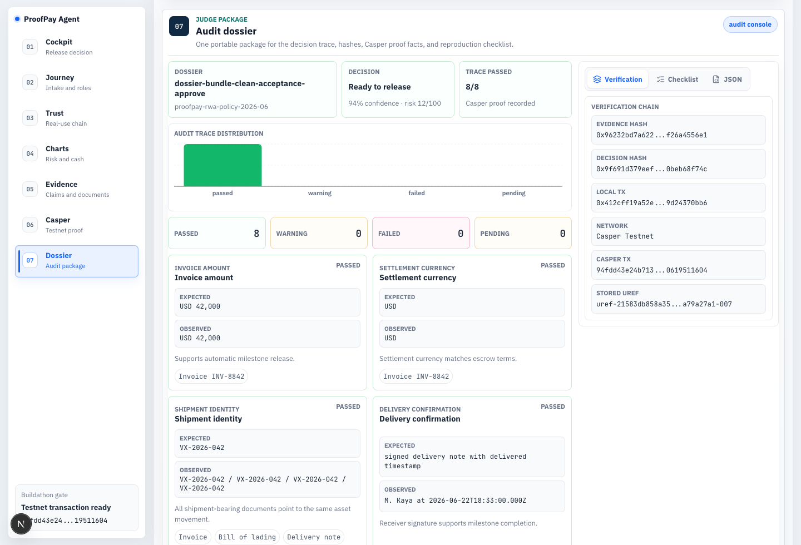
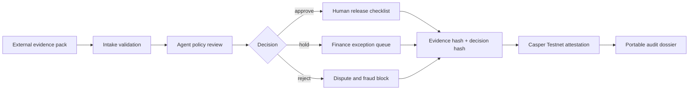
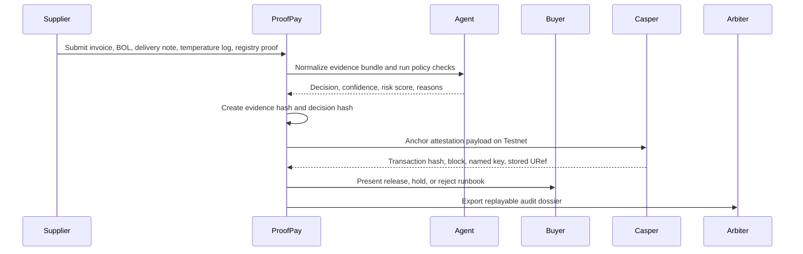

<div align="center">

# ProofPay Agent

### Agentic RWA Milestone Escrow on Casper

**AI verifies off-chain delivery evidence. Humans control payment release. Casper records the decision proof.**

[](https://github.com/Sskift/casper-proofpay-agent/blob/main/docs/demo/proofpay-agent-demo.mp4)
[](https://sskift.github.io/casper-proofpay-agent/)
[](https://github.com/Sskift/casper-proofpay-agent/actions/workflows/ci.yml)
[](https://dorahacks.io/buidl/45992)
[](docs/casper-testnet.md)
[](#audit-dossier)

[](#agent-workflow)
[](#why-this-matters)
[](#why-this-matters)
[](#status)

</div>

## One-Line Thesis

ProofPay Agent is a verifiable RWA payment decision chain: external delivery evidence enters the system, an agent produces an explainable `approve`, `hold`, or `reject` recommendation, and Casper Testnet anchors the evidence hash and decision hash for later audit.

## Buildathon Snapshot

| Field | ProofPay Agent |
| --- | --- |
| Buildathon | Casper Agentic Buildathon |
| Track fit | Agentic AI, DeFi, Real-World Assets |
| Product | AI-assisted milestone escrow for real-world supplier payments |
| Primary users | Buyer operations, supplier finance, dispute arbiter, protocol reviewer |
| Agent task | Review invoices, bill of lading, delivery note, temperature log, and supplier registry evidence |
| Decision outputs | `approve`, `hold`, `reject`, confidence, risk score, reviewer actions |
| Casper role | Public attestation anchor for evidence hash, decision hash, milestone id, and final decision |
| Testnet proof | Three recorded Casper Testnet transactions for clean, hold, and reject judge flows |
| Live demo | [casper-proofpay-agent-web.vercel.app](https://casper-proofpay-agent-web.vercel.app/) |
| Static backup | [sskift.github.io/casper-proofpay-agent](https://sskift.github.io/casper-proofpay-agent/) |
| Demo asset | [docs/demo/proofpay-agent-demo.mp4](docs/demo/proofpay-agent-demo.mp4) |
| Boundary | Prototype does not custody real funds; it models milestone state plus on-chain attestation |

## Why This Matters

Real-world asset payments are slow because the evidence lives off-chain: documents, shipment logs, signatures, registry checks, and finance exceptions. A plain AI review can speed the work, but it can also become a black box. A plain smart contract can hold a state, but it cannot interpret a bill of lading or a cold-chain exception by itself.

ProofPay joins the two:

- The agent turns messy delivery evidence into a bounded payment recommendation.
- The operator keeps final release authority for real funds.
- Casper records the exact evidence hash and decision hash so the review can be replayed.
- Suppliers, buyers, and arbiters share one audit package instead of arguing over screenshots and email threads.

This is more than a frontend dashboard: the repository includes deterministic evidence scoring, hash generation, local API hooks, Casper attestation payload generation, Testnet transaction evidence, contract materials, CLI runbooks, and a portable audit dossier.

## What Is Real

- Deterministic evidence intake, validation, scoring, reasons, follow-up actions, evidence hashes, and decision hashes in `packages/agent`.
- Casper attestation payload generation, deploy command generation, verifier checks, and recorded Testnet deployment facts in `packages/casper`.
- Three successful Casper Testnet transactions for clean release, finance hold, and duplicate reject scenarios.
- Next.js dashboard surfaces for cockpit review, Judge walkthrough, evidence intake playground, Casper proof workbench, and audit dossier.
- Dynamic Next API hooks for attestation lookup, external evidence intake, MCP-style access, and x402-style release gating.
- Real-case CLI path to prepare a new evidence JSON package and submit a fresh Casper Testnet attestation from a local funded signing key.

## What Is Simulated

- ProofPay does not custody real funds in this prototype and does not claim production escrow settlement.
- The Vercel demo is the public full-stack dashboard with API routes. The GitHub Pages demo remains a stable static backup and falls back to deterministic client replay.
- The agent is deterministic and bounded for auditability; production OCR, identity verification, wallet signing, and payment rail integration are future work.

## How To Verify

1. Open the [live Vercel demo](https://casper-proofpay-agent-web.vercel.app/) and use the Judge walkthrough: Cockpit, Trust, Evidence, Casper, Dossier.
2. In Casper, switch clean / hold / reject scenarios, open `View on cspr.live`, and compare transaction hash, block height, named key, stored URef, evidence hash, and decision hash.
3. In Trust, load each evidence intake sample, click `Assess evidence`, and confirm the recomputed decision, risk score, confidence, evidence hash, decision hash, reasons, actions, and mini dossier preview. On a Next server this calls `POST /api/evidence/intake`; on GitHub Pages it falls back to deterministic client replay.
4. Locally run `npm install`, `npm test`, `npm run typecheck`, `npm run build`, `npm run pages:build`, and `npm run submission:check`.
5. For live API replay, run `npm run dev -- --hostname 127.0.0.1 --port 3000`, then call `GET /api/attestation/clean` or `POST /api/evidence/intake`.
6. For public full-stack replay, run `npm run fullstack:smoke -- https://casper-proofpay-agent-web.vercel.app`.
7. For a new real case, fill [examples/real-case-template.json](examples/real-case-template.json), run `npm run realcase:prepare -- path/to/real-case.json`, then follow [docs/real-case-runbook.md](docs/real-case-runbook.md) before submitting a fresh Testnet transaction.

## Why This Is Not A Generic x402 Gateway

ProofPay does not try to replace escrow custody in this prototype. It creates the missing RWA evidence decision layer before release: evidence normalization, bounded AI review, human release control, and Casper attestations that make the decision replayable. The x402-style route is a demo integration surface for release decisions, not the product thesis.

## Screenshots

| Operations cockpit | Trust chain |
| --- | --- |
|  |  |

| Casper proof | Audit dossier |
| --- | --- |
|  |  |

## Demo Map

| Step | Dashboard area | What the judge should see |
| --- | --- | --- |
| 1 | Cockpit | The current milestone, readiness score, risk score, evidence coverage, and decision path are visible immediately. |
| 2 | Journey | Evidence intake, participant roles, scenario evaluation, and MCP/x402/Casper hooks are separated into tabs. |
| 3 | Trust | External evidence, agent decision, human release control, and Casper verification are shown as one proof chain. |
| 4 | Charts | Risk, cold-chain telemetry, escrow cashflow, and evidence coverage are shown with reusable chart components. |
| 5 | Evidence | Invoice, bill of lading, delivery note, temperature log, supplier registry, claims, timeline, and follow-up actions are reviewable. |
| 6 | Casper | The selected scenario shows Testnet transaction hash, block, named key, stored URef, payload, and deploy command. |
| 7 | Dossier | The portable review package combines evidence hash, decision hash, Casper proof facts, checklist, and JSON artifact. |

## What Judges Should Notice

| Signal | Why it matters |
| --- | --- |
| Real RWA workflow | The demo is built around a temperature-controlled vaccine shipment and supplier milestone payment. |
| Bounded agent authority | The agent recommends payment actions, but human release control remains explicit. |
| Three exception paths | Clean release, finance hold, and duplicate-invoice reject are all modeled. |
| Casper evidence | Each judge scenario has a recorded Casper Testnet transaction, not only a local mock. |
| Replayable proof | Evidence hash, decision hash, named key, stored URef, and transaction hash are packaged together. |
| Integration surface | Local APIs demonstrate evidence intake, MCP-style access, x402-style release gating, and attestation retrieval. |
| Submission discipline | Hackathon rules, CLI runbook, demo script, Testnet notes, and final checklist are committed in the repo. |

## System Thesis



## Agent Workflow



## Casper Attestation Evidence

All three judge scenarios have recorded Casper Testnet transaction-producing components:

| Scenario | Agent decision | Casper Testnet transaction |
| --- | --- | --- |
| Clean release | `approve` | `94fdd43e24b713a0644b560c5f9e107cc8b6e0e317bc31b2d8d3940619511604` |
| Hold for finance | `hold` | `c92cdcd8f11f6453134745900ea2c91defa0f8b37f4c6782dd38b2aa7a720d84` |
| Reject duplicate | `reject` | `08995093b6ef978b381c4cee7d8faeb960f31bb64083544c8cfa0c3c8952e885` |

Current named key facts:

```text
named_key: proofpay_attestation_ms-delivery-acceptance
current_named_key_uref: uref-409325b098f841565f2667d96986d7f41ff08e606f33bf06f76a0564ac1eb76f-007
```

Full proof notes are in [docs/casper-testnet.md](docs/casper-testnet.md). Casper CLI commands and deployment shapes are in [docs/casper-cli-runbook.md](docs/casper-cli-runbook.md).

## Audit Dossier

The audit dossier is the artifact a buyer, supplier, or arbiter can keep after the agent decision. It is designed to survive outside the dashboard and still explain what happened.

It packages:

- Dossier id, deal id, milestone id, policy version, decision, confidence, and risk score.
- Normalized evidence observations from invoice, bill of lading, delivery note, temperature log, and supplier registry.
- Agent trace steps with passed, warning, failed, or pending status.
- Evidence hash, decision hash, local demo transaction hash, Casper Testnet transaction hash, named key, and stored URef.
- Reviewer checklist for release, hold, reject, and dispute follow-up.
- Copy-ready JSON for a future MCP client, compliance archive, or payment operations desk.

## Current Implementation

```text
apps/web                       Next.js dashboard and API routes
packages/agent                 Evidence model, seeded RWA data, scoring policy, hashes
packages/casper                Attestation payloads and local demo transaction adapter
contracts/proofpay-attestation Casper/Odra contract materials
docs                           Submission, demo, Testnet, and runbook documentation
```

Core dashboard capabilities:

- Scroll-tracked operator sidebar for the seven judge sections.
- Compact Judge walkthrough for Cockpit, Trust, Evidence, Casper, and Dossier.
- Scenario switcher for `approve`, `hold`, and `reject` payment flows.
- Evidence room for documents, claims, timeline, reasons, and follow-up actions.
- Recharts-based visuals for risk, cold-chain telemetry, cashflow, evidence coverage, Casper checks, and audit trace distribution.
- Evidence intake playground with JSON sample loaders, API-first assessment through `POST /api/evidence/intake`, static fallback replay, hashes, reasons, next actions, and mini dossier preview.
- Casper proof workbench with CSPR.live links, copy buttons, transaction hash, block height, named key, stored URef, deploy command, explicit verification states, and readiness gates.
- Audit dossier workbench with decision trace, hashes, Testnet proof facts, reproduction checklist, and copy-ready JSON.

Local integration hooks:

```text
GET  /api/attestation/clean
GET  /api/attestation/amountMismatch
GET  /api/attestation/duplicateInvoice
GET  /api/health
POST /api/evidence/intake
POST /api/real-case/prepare
GET  /api/mcp
POST /api/x402/release-decision
```

These endpoints are demo hooks, not production payment infrastructure. They show how ProofPay can accept an external evidence bundle, return an agent decision, create a Casper attestation payload, verify recorded Testnet proof fields, and hand settlement actions or audit dossiers to MCP-style clients or x402-gated agent commerce.

## Local Development

```bash
npm install
npm run test
npm run typecheck
npm run build
npm run dev -- --hostname 127.0.0.1 --port 3000
```

Open:

```text
http://127.0.0.1:3000
```

Useful scripts:

```bash
npm run submission:check        # repository cleanliness and submission asset check
npm run realcase:prepare        # prepare a new redacted evidence JSON for Testnet attestation
npm run realcase:deploy:print   # inspect the new Casper Testnet transaction command
npm run realcase:deploy:testnet # submit the new case from a funded local Testnet key
npm run attestation:export      # print a scenario's Casper attestation payload
npm run casper:check            # verify Casper CLI, Testnet RPC, and account status
npm run contract:build          # build Casper Wasm
npm run contract:deploy:print   # print Casper Testnet deploy command shapes
npm run contract:deploy:testnet # send or reproduce a Casper Testnet transaction
```

## DoraHacks Assets

Prepared submission materials:

- [docs/buidl-submission-brief.md](docs/buidl-submission-brief.md)
- [docs/submission-checklist.md](docs/submission-checklist.md)
- [docs/demo-script.md](docs/demo-script.md)
- [docs/demo-recording-workflow.md](docs/demo-recording-workflow.md)
- [docs/fullstack-hosting.md](docs/fullstack-hosting.md)
- [docs/next-iteration-agent-brief.md](docs/next-iteration-agent-brief.md)
- [docs/real-world-use.md](docs/real-world-use.md)
- [docs/real-case-runbook.md](docs/real-case-runbook.md)
- [docs/demo/proofpay-agent-demo.mp4](docs/demo/proofpay-agent-demo.mp4)
- [docs/casper-testnet.md](docs/casper-testnet.md)
- [docs/casper-cli-runbook.md](docs/casper-cli-runbook.md)
- [docs/hackathon-constraints.md](docs/hackathon-constraints.md)

Public demo video URL for the DoraHacks BUIDL form:

```text
https://github.com/Sskift/casper-proofpay-agent/blob/main/docs/demo/proofpay-agent-demo.mp4
```

Final submission still happens through DoraHacks `Submit BUIDL`; there does not appear to be a DoraHacks CLI submission path. The repository-level rules are captured in [docs/hackathon-constraints.md](docs/hackathon-constraints.md).

## Status

- [x] Public GitHub repository
- [x] Public demo video
- [x] Casper Testnet transaction evidence for clean, hold, and reject scenarios
- [x] Evidence scoring and deterministic hash generation
- [x] Casper attestation payload and verifier panel
- [x] Operator dashboard with scenario switcher and charted proof sections
- [x] Audit dossier with replayable proof facts
- [x] Dynamic MCP-style, x402-style, evidence intake, and attestation APIs for local or full-stack Next hosting
- [x] DoraHacks BUIDL materials
- [x] Hosted public read-only deployment on GitHub Pages
- [x] Demo recording workflow and next-iteration agent brief
- [ ] Production custody, wallet signing, OCR, and live payment settlement

## Roadmap

- Full-stack hosted demo through Vercel or equivalent dynamic Next host, while GitHub Pages remains the stable public dashboard backup.
- Direct Casper state query in the dashboard instead of recorded proof facts.
- Wallet-native buyer signing and supplier payout handoff.
- OCR and document ingestion pipeline for real invoices and logistics documents.
- External MCP server for agent-to-agent proof retrieval.
- Shareable dossier export page for buyers, suppliers, and arbiters.

## Prototype Boundary

This hackathon prototype does not custody real funds. Escrow is represented as milestone state plus a Casper attestation record. Seeded evidence is synthetic for repeatable judge-mode demos, while `POST /api/evidence/intake` and the dashboard intake lab demonstrate how an external normalized evidence bundle enters the same assessment and verification path on a dynamic Next server.

The product goal is simple: make AI-assisted RWA payment review faster without making it unverifiable.
